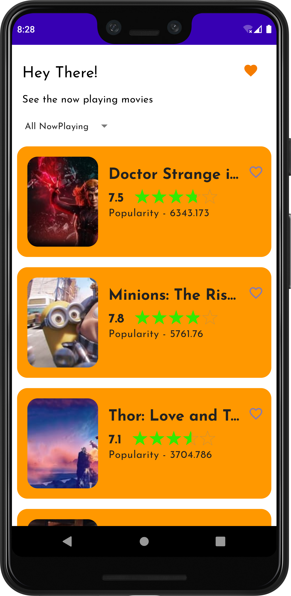
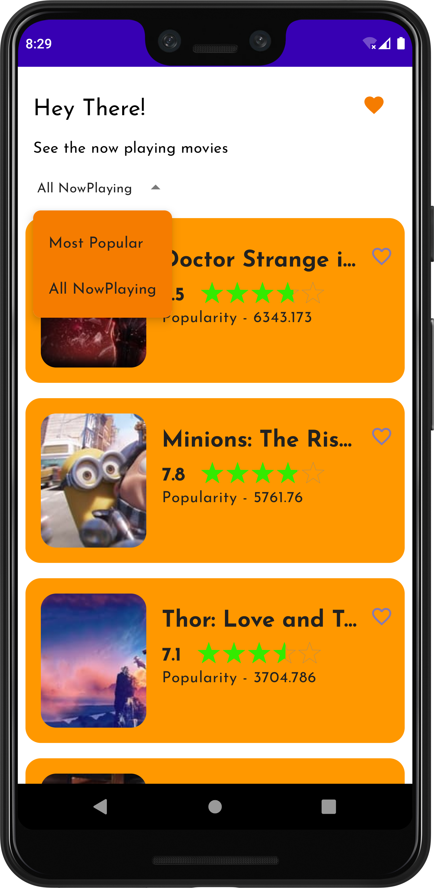
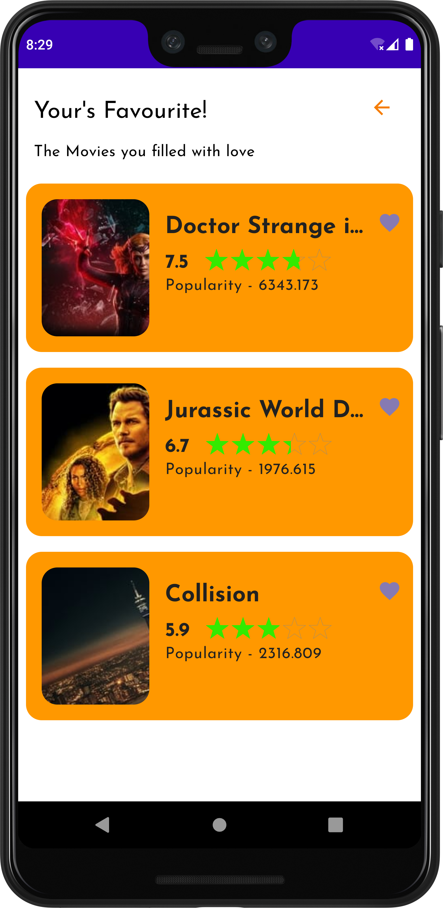

# NowPlaying-App

NowPlaying is a movie show preview app which shows the NOW PLAYING & MOST POPULAR movies around the
world using the [TMDB api](https://api.themoviedb.org/), & This project is built as an assignment
for Cube Wealth. This app is built with using Jetpack compose and MVVM Architecture.

[NowPlayApp.apk](https://drive.google.com/file/d/1NiesJWv8MtviTvefQKzbrECQx6w-BuGm/view?usp=sharing)

## Screenshots

| | | |
| | | |

)

## 🗼 Architecture

This app uses [***MVVM (Model View
View-Model)***](https://developer.android.com/jetpack/docs/guide#recommended-app-arch) architecture.

## 🧰 Build-tool

You need to have [Android Studio (BumbleBee) or above](https://developer.android.com/studio/preview)
to build this project.

